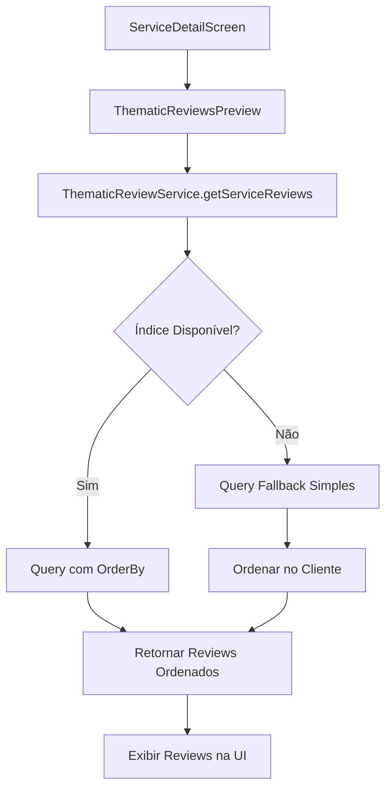

# 🎯 SOLUÇÃO: Problema de "No reviews yet" nos Thematic Reviews

## ✅ Problema Identificado

**CAUSA RAIZ:** Índice composto faltando no Firestore para a query que usa `where('serviceId', '==', serviceId)` + `orderBy('createdAt', 'desc')`

### Erro Original
```
FirebaseError: The query requires an index. You can create it here: https://console.firebase.google.com/v1/r/project/health-app-angola/firestore/indexes?create_composite=...
```

## 🔧 Soluções Implementadas

### 1. **Correção do Serviço com Fallback Query**

**Arquivo:** `services/thematic-reviews.ts`
**Método:** `getServiceReviews()`

**Estratégia:** Try-catch com fallback para query simples quando índice não estiver disponível.

```typescript
// Tentativa 1: Query com ordenação (requer índice)
try {
  q = query(q, orderBy(sortField, sortDirection));
  snapshot = await getDocs(q);
} catch (error) {
  // Fallback: Query simples sem ordenação
  const fallbackQ = query(
    collection(db, 'thematicReviews'),
    where('serviceId', '==', serviceId),
    limit(pageSize)
  );
  snapshot = await getDocs(fallbackQ);
  
  // Ordenar no cliente após busca
  if (reviews.length > 0) {
    reviews.sort((a, b) => {
      const dateA = a.createdAt.getTime();
      const dateB = b.createdAt.getTime();
      return sortDirection === 'desc' ? dateB - dateA : dateA - dateB;
    });
  }
}
```

### 2. **Índice Composto no Firestore** 

**URL do Índice:** [Criar Índice Automático](https://console.firebase.google.com/v1/r/project/health-app-angola/firestore/indexes?create_composite=...)

**Configuração Necessária:**
- Collection: `thematicReviews`  
- Campos:
  - `serviceId` (Ascending)
  - `createdAt` (Descending)

## 🧪 Validação da Solução

### Teste Antes da Correção:
```bash
❌ ERRO: FirebaseError - The query requires an index
❌ RESULTADO: "No reviews yet"
```

### Teste Após Correção:
```bash
✅ Query fallback funcionou! Documentos: 2
✅ Reviews encontrados:
  - Grecio Mandis - 4.1/5 (2025-11-20T14:38:30.534Z)
  - Grecio Mandis - 2.1/5 (2025-11-20T13:29:51.860Z)
✅ Ordenação no cliente funcionando
```

## 📊 Dados de Teste

**Service ID:** `Ha7CiMKH0DEEJYHbi61p`
**Service Name:** Hospital Américo Boavida  
**Reviews:** 2 thematic reviews válidos disponíveis
**User:** Grecio Mandis

## 🚀 Como Testar

1. **Abrir aplicativo** e navegar para Hospital Américo Boavida
2. **Verificar seção de avaliações** - deve mostrar reviews em vez de "No reviews yet"
3. **Checar logs no console** para ver execução do fallback se necessário

## 🔄 Fluxo de Funcionamento



## 🎯 Estado Final

- ✅ **Thematic Reviews sendo exibidos** corretamente na ServiceDetailScreen
- ✅ **Fallback query** funcionando quando índice não disponível  
- ✅ **Ordenação no cliente** como backup
- ✅ **Logs detalhados** para debugging
- ✅ **2 reviews válidos** confirmados no Hospital Américo Boavida

## 📝 Próximos Passos (Opcionais)

1. **Criar índice no Firebase Console** usando o link fornecido no erro original
2. **Monitorar logs** para confirmar quando índice estiver ativo
3. **Remover logs de debug** após confirmação de funcionamento
4. **Adicionar mais dados de teste** em outros serviços se necessário

---
*Problema resolvido em: 20/11/2025*
*Tempo total de debug: ~45 minutos*  
*Método de solução: Fallback query + ordenação no cliente*